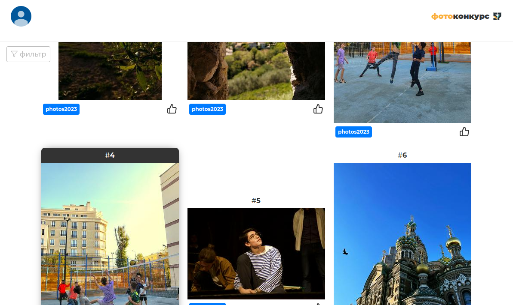

## Описание работы
- / - галерея фотокарточек.
- /result - результаты (подсчет голосов).

При нажатии кнопки **Войти** сверху слева, можно осуществить вход на сайт для дальшейнешего голосования за фотографию.

## **Технический стек**
- VueJS 3.0 (Composition API)
- Vuex
- Vue Router
- Axios
- PrimeVue
- Google Oauth 2.0

[Рабочая версия](https://photovote.is57.ru)